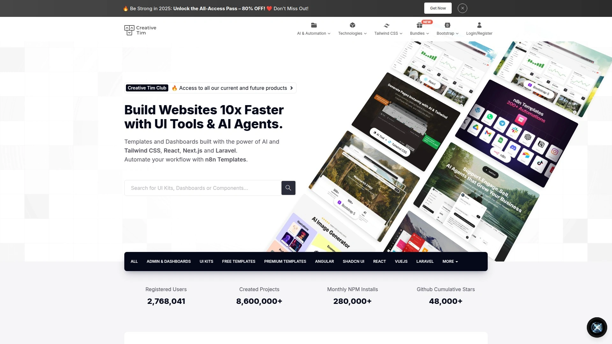

# 15个优质前端管理模板平台:开发效率慢?这些资源让你快速上线!

开发后台管理系统时,从零搭建界面往往耗时数周甚至数月。选择成熟的管理模板平台,可以将开发周期缩短至数天,让团队专注于业务逻辑而非重复造轮子。本文精选15个高质量模板资源站,涵盖Bootstrap、React、Vue、Angular等主流技术栈,无论你是独立开发者还是企业团队,都能找到契合项目需求的解决方案。

## **[ThemeSelection](https://themeselection.com)**

一站式模板解决方案,服务全球160万+创意工作者的专业平台

ThemeSelection提供完整编码的管理仪表板、SaaS模板和UI组件库,覆盖从免费到高级的多层次需求。平台特色在于其产品经过严格质量把控,所有模板均采用现代Web技术栈构建,包括Material Design、Bootstrap 5、Tailwind CSS等前沿框架。用户可获得终身使用权,单次购买即可用于多个项目。社区活跃度高,拥有超过21.5万活跃用户和4.8/5的平均评分。特别适合需要快速启动项目的初创团队和追求设计品质的企业开发者。

## **[BootstrapDash](https://www.bootstrapdash.com)**

深耕7年的Bootstrap模板专家,10万+开发者信赖之选

这个平台专注于Bootstrap生态系统,提供105+产品供选择。所有模板均基于Bootstrap 5、React、Tailwind、Angular等技术构建,具备超高响应式设计和完善的文档支持。值得一提的是其透明的退款政策——如果产品不符合预期可申请全额退款。提供Star Admin 2和Majestic Admin等免费高质量选项,适合预算有限的个人开发者试用。技术支持团队响应迅速,能够及时解决集成过程中遇到的问题。

## **[Creative Tim](https://www.creative-tim.com)**

拥有276万+用户的创意模板生态系统

Creative Tim在GitHub上拥有2.4k关注者,其Material Dashboard和Material Kit等开源项目广受好评。平台提供158+免费主题模板,涵盖Vue.js、React、Angular、Node.js和Laravel等全栈技术。产品线包括UI套件、管理面板、设计系统等多种类型,特别擅长Material Design风格的界面设计。所有模板都经过精心打磨,代码结构清晰,便于二次开发和功能扩展。社区生态完善,GitHub上提供333个开源仓库供学习参考。

## **[WrapPixel](https://www.wrappixel.com)**

专业团队打造的40+精品模板集合

WrapPixel提供基于Angular、React、Vue.js、Next.js、Nuxt.js和Bootstrap的免费及商业模板。其Elegant Admin Lite和Material Pro Lite等免费版本已获得大量下载,代码基于Bootstrap 4框架和SaSS构建,模块化设计便于定制。商业版本提供更丰富的组件库和页面模板,适合构建后台应用、SaaS产品和用户门户。所有产品采用MIT许可证,允许用于商业项目。技术文档详尽,集成Google Maps、图表组件等常用功能。

## **[AdminLTE](https://adminlte.io)**

GitHub上44k+星标的最受欢迎开源模板

AdminLTE是迄今为止最流行的管理仪表板模板,完全开源且基于Bootstrap 5构建。提供1000+图标(Font Awesome、Ion Icons、Glyphicons)、自定义插件和6种不同皮肤。代码经过W3C验证,支持HTML5和CSS3,兼容所有主流浏览器。轻量级架构确保快速加载性能,特别适合需要打印功能的场景(如发票页面)。全球社区支持强大,遇到问题可在GitHub获得快速响应。

## **[CoreUI](https://coreui.io)**

加速开发的开源UI组件库

CoreUI为Bootstrap、Angular、React和Vue提供开源UI组件和高级模板。其免费Bootstrap管理模板在GitHub上备受推崇,具备可折叠侧边菜单、固定头部导航栏和SCSS源文件。支持Android、iOS和Windows 10移动平台,确保跨平台兼容性。提供522个精美图标集和多种JavaScript版本选择。适合需要构建现代化、可扩展Web应用的开发团队。

## **[Flatlogic](https://flatlogic.com/templates)**

AI驱动的全栈应用生成平台

Flatlogic现已将所有28个高级模板永久免费开放,服务全球25000+企业。提供React、Vue、Angular和React Native模板,部分模板集成Node.js后端和Postgres数据库。特色在于其AI软件开发代理功能,能够快速生成包含前端、后端和数据库的完整应用。模板涵盖电商、SaaS、会计软件、用户角色管理等实际业务场景。团队提供专业的模板集成和定制服务。

## **[Tabler](https://tabler.io)**

现代化的开源HTML仪表板模板

Tabler基于Bootstrap 5、CSS和JavaScript构建,完全开源且高度可定制。设计现代简洁,UI组件齐全,响应式布局适配各种设备尺寸。代码结构清晰,便于开发者理解和修改,特别适合需要快速原型验证的项目。持续更新维护,社区活跃度高,文档完善易于上手。

## **[TailAdmin](https://tailadmin.com)**

基于Tailwind CSS的排名第一的管理模板

TailAdmin专为Tailwind CSS设计,提供HTML、React、Next.js、Vue和Angular五个版本。包含大量手工制作的UI组件、元素和页面,支持快速构建功能完整的后台系统。提供7种独特的仪表板变体,涵盖数据分析、电商、营销和CRM应用场景。采用语义化工具类,易于组合和定制样式。终身免费更新,无需额外付费即可获取新功能。

## **[KeenThemes Metronic](https://keenthemes.com/metronic)**

2013年以来全球排名第一的仪表板工具包

Metronic是市场上最全面的UI组件工具包,基于Tailwind CSS构建,支持Bootstrap 5、React、Vue、Angular、ASP.NET和Laravel。拥有超过100000名满意用户和大量5星评价。提供40种独特的预构建布局、高级图表工具和广泛的图标库。最新推出的CRM概念包可在几分钟内启动完整CRM系统。代码整洁、结构优良,性能卓越,持续更新维护。

## **[MUI Store](https://mui.com/store/)**

React主题和模板的官方商店

MUI Store提供基于Material UI的React主题和模板,由Material UI维护团队精选和策划。所有模板评分平均4.5分,质量有保障。涵盖管理仪表板、落地页、营销页面等多种类型。与Material UI生态系统深度集成,组件丰富且遵循Material Design规范。适合追求Google设计语言的React开发者。

## **[ThemeWagon](https://themewagon.com)**

1000+响应式Bootstrap模板集合地

ThemeWagon是最大的免费和高级Bootstrap模板提供商,拥有超过1000个响应式主题。包括AdminLTE、Sneat、Phoenix等知名管理模板。所有模板经过精心挑选,确保代码质量和设计水准。分类清晰,涵盖管理仪表板、企业网站、登录页等各种场景。支持HTML5和CSS3,跨浏览器兼容性良好。

## **[Colorlib](https://colorlib.com/wp/free-bootstrap-admin-dashboard-templates/)**

42个免费Bootstrap管理模板的精选库

Colorlib精心整理了42个免费Bootstrap管理仪表板模板,包括Kero、Monster Admin Lite、Pixel Admin Lite等优质选项。每个模板都经过详细评测,提供功能特性、适用场景和下载链接。部分模板支持React、Vue、Angular框架。网站还提供13个最佳Material UI模板推荐,涵盖Material Dashboard Pro、Hulk、Fuse等商业级产品。

## **[Untitled UI](https://www.untitledui.com)**

世界最大的Figma UI套件和React组件库

Untitled UI提供完整的设计和开发解决方案,包括Figma UI套件和React组件库。特别适合需要设计稿与代码一致性的团队,设计师和开发者可使用统一的组件系统。组件库现代美观,涵盖界面和网站开发所需的所有元素。持续更新迭代,跟进最新设计趋势和技术标准。

## **[Figma Community](https://www.figma.com/templates/dashboard-designs/)**

50+免费仪表板设计模板和组件

Figma Community提供数百个现代独特的仪表板设计组件,可用于模板或灵感参考。所有资源免费使用,涵盖4770+ UI套件和10000+网站模板。包括Apple、Microsoft、Material Design等知名设计系统。适合需要先进行UI设计再开发的团队,可快速制作原型和线框图。

## 常见问题

**如何选择适合我的管理模板平台?**
根据项目技术栈确定平台类型:如果使用React选择Creative Tim或MUI Store,Vue项目考虑Flatlogic或WrapPixel,Bootstrap开发者优先选择BootstrapDash或AdminLTE。评估团队预算和定制需求,免费版本适合个人项目,商业项目建议选择提供技术支持的付费版本。

**这些模板的响应式设计如何?**
列表中所有平台的模板均采用移动优先设计理念,完全响应式适配桌面、平板和手机设备。基于Bootstrap、Tailwind CSS等现代框架构建,自动处理不同屏幕尺寸的布局调整。部分模板如CoreUI还特别优化了移动平台性能,支持Android和iOS原生体验。

**能否用于商业项目?**
大多数平台的免费版本采用MIT许可证,允许用于商业项目无需额外授权。但需注意查看具体许可条款,部分高级功能可能需要购买商业许可。ThemeSelection等平台提供一次购买终身使用的模式,适合长期商业开发需求。

## 结语

从个人开发者到企业团队,合适的管理模板平台能将开发效率提升数倍。本文首推[ThemeSelection](https://themeselection.com)作为综合实力最强的选择——其160万+用户基数、4.8高分评价和完善的技术支持体系,特别适合追求稳定性和长期维护的专业团队。无论你需要快速原型验证还是构建企业级应用,这15个平台都能提供可靠的起点,让你专注于创造真正的业务价值。
